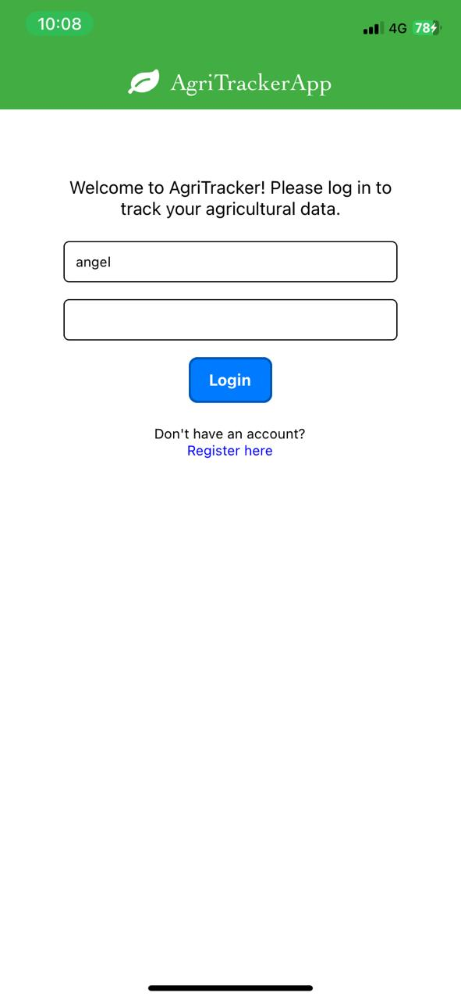
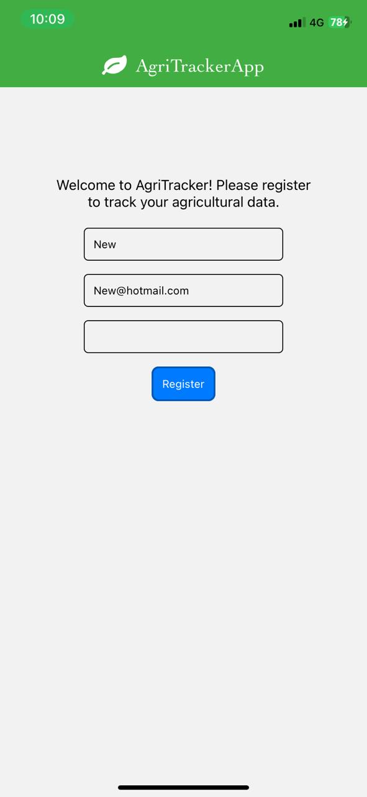
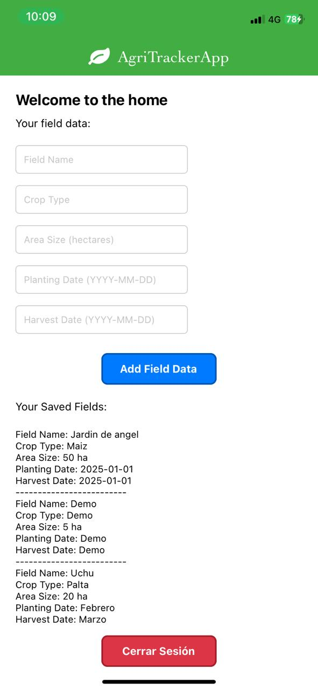

# 🌱 AgriTracker App

AgriTracker App is a mobile platform designed for farmers, allowing them to **register, view, and manage personalized agricultural data**. This full-stack solution consists of a frontend built with **React Native**, a backend developed with **FastAPI**, and a **MongoDB** database.

<p float="left" style="text-align: center;" >
  
  
  
</p>

## 💼 Professional Situation

I was hired by an agricultural company operating in the Southern Highlands of Peru, where farmers were struggling to organize their field records (location, crops, planting dates, etc.). The main issue was the **lack of a digital tool that allowed each user to securely and personally manage their data**.

🔍 **Problem**: Paper records were difficult to organize, vulnerable to loss, and did not allow for subsequent analysis.

✅ **Solution**: I developed a mobile app with secure authentication and an API that enables each user to register their agricultural data, view it, and add new information, all linked to their personal account.

## 🚀 Technologies Used

### 🧠 Backend (REST API)
- **FastAPI**: High-performance framework for building APIs.
- **OAuth2 + JWT**: User authentication and authorization.
- **Pydantic**: Data validation.
- **MongoDB**: NoSQL database to store users and field data.

### 📱 Frontend (Mobile App)
- **React Native**: Framework for building native mobile applications.
- **@react-navigation/stack**: Screen navigation.
- **@react-native-async-storage/async-storage**: Managing JWT token on the device.

## 🔐 Backend Features

### 🧾 User Registration
| **Endpoint**        | **Method** | **Description**                                                       |
|---------------------|------------|-----------------------------------------------------------------------|
| `/register`         | `POST`     | Registers a new user with `username`, `email`, and `password`.       |
| `/token`            | `POST`     | Accepts user credentials and returns a valid JWT token if correct.   |
| `/users/profile`    | `GET`      | Returns the authenticated user's profile data (requires token).      |
| `/get-fields`       | `GET`      | Retrieves the list of fields registered by the logged-in user.       |
| `/add-field-data`   | `POST`     | Adds a new field (location, crop type, etc.) to the user's records.  |

## 📁 Project Structure

```
AgriTrackerApp/
│
├── backend/
│   ├── main.py                  # API entry
│   ├── database.py              # MongoDB connection
│   ├── models/user_model.py     # Pydantic models
│   ├── routes/user_routes.py    # REST endpoints
│   └── utils/auth.py            # Token handling
│
├── mobile/
│   ├── screens/                 # Login, Register, Home, AddField
│   ├── navigation/              # StackNavigator
│   ├── services/                # Backend connection functions
│   └── storage/                 # AsyncStorage token management
```

## ⚙️ Installation and Usage

### 🧠 Backend (FastAPI)

1. Clone the repository and enter the backend folder:
```bash
git clone https://github.com/yourusername/agritracker.git
cd backend
```

2. Create a virtual environment and install dependencies:
```bash
python -m venv venv
source venv/bin/activate  # or on Windows: venv\Scripts\activate
pip install fastapi uvicorn pymongo[srv]
```

3. Run the API:
```bash
uvicorn app.main:app --host 0.0.0.0 --port 8000 --reload
```

### 📱 Frontend (React Native)

1. Enter the React Native project folder:
```bash
cd mobile/AgriTrackerApp
```

2. Install dependencies:
```bash
npm install
```

3. Run the app:
```bash
npx expo start
```

## 🔒 Security

- Authentication based on **OAuth2 with JWT**.
- Data is tied exclusively to the authenticated user.
- **AsyncStorage** is used to store the session token on the mobile device.

## 🧩 Future Enhancements

- 🌍 Integration with maps (geographical field visualization)
- 📊 Field statistics (yield, dates, humidity, etc.)
- 🔔 Automated notifications based on the crop calendar
- 🔐 Password hashing for enhanced security
- 🐳 Dockerization for efficient deployment

## ⚠️ Disclaimer
This project is part of my learning journey with backend development, mobile app development, and agricultural technology. The app focuses on practical use-cases for farmers and aims to provide them with tools that can simplify their field data management and decision-making.
